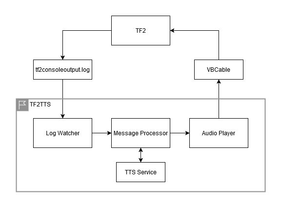

# tf2tts

A tool that converts your tf2 chat messages to speech and plays them through vc.

## Installation

WIP

## Architecture

## Todos

In no particular order

Alpha:
- [ ] rearrange the tts module, maybe move `tts_impl` to an example provider
- [ ] add audio device to config
- [ ] potentially extract config into a config file
- [ ] turn this into a workspace, the main core lib, a terminal/gui app, etc.
- [ ] examples
- [ ] examples with custom tts providers as well
- [ ] modular error handling, so that this could be used in a gui/terminal app in the future, for example an app might want to catch critical errors and restart one of the components, or they might want to catch non-cricial errors and notify the user about them
- [ ] some docs
- [ ] create a simple gui
- [ ] finish the installation guide
- [ ] release on `crates.io`

Future:
- [ ] improve the default `tts_impl`, fetch concurrently rather than sequentially
- [ ] better logging
- [ ] maybe figure out RVC for more voice choie freedom
- [ ] possibly improve error handling or sender/receiver stuff
- [ ] allow for more config options, such as providing a vc key other than the default V
- [ ] installer for this? not sure how one would achieve that considering that it involves external software and running commands in tf2

## Contributing

Issues and pull requests are welcome!

## Credits

Inspired by [TF2ChatToSpeech](https://github.com/Joey-Einerhand/TF2ChatToSpeech)